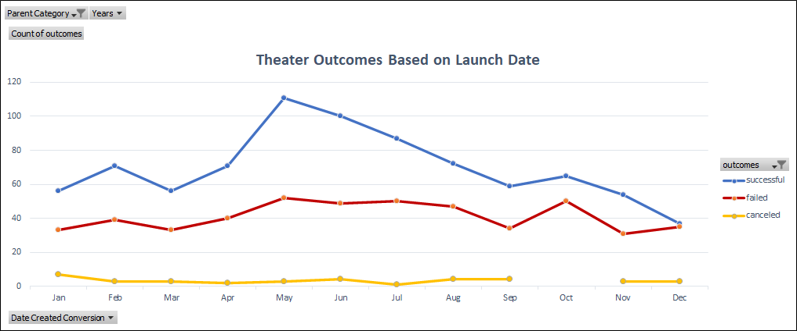
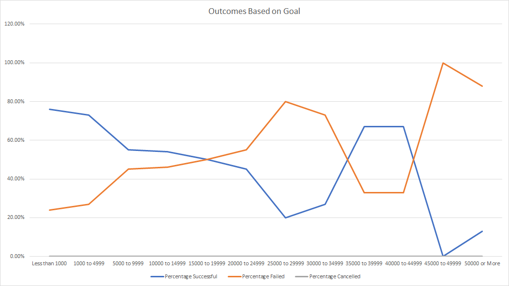

# Kickstarting with Excel
 
## Overview of Project
Louise is an upcoming play writer who wants to start a crowdfunding campaign to help fund her play "Fever" for which she is estimating a budget of $10,000. She wants our help to determine whether there are specific factors that make project campaigns successful. We will be analyzing and sorting crowdfunding data to determine the same.
 
### Purpose
Using Excel to help analyze the data, we will help Louise gain an understanding of campaigns from start to finish and will be able to set her campaign to mirror the other successful ones in the same category
 
## Analysis and Challenges
At initial look into the data, we need to determine what data types we are working with, the size of the data set and if the data is readable. The next step is to filter, sort and organize the data to see only relevant information for our purpose. 

Once the data has been sorted, we will interpolate the columns together to create visual feedback to help us see relationship between varying factors. In creating these charts, we must consider any outlier in the dataset as it may skew the charts. 

### Analysis of Outcomes Based on Launch Date
The chart shown below is a representation of the relationship between the outcomes of the campaigns in the theater category in all countries and their start dates. Immediately, we see that the highest number of campaigns begins during the warmer months; May, June, July & August, with the most successful campaigns being in May. In contrast, the highest failed campaigns in relative to total campaigns, occurs during October to December.

An interesting point in the chart below is that the line between ‘Successful’ and ‘Cancelled’ nearly intersects during the month of December. We can infer that due to the Christmas Holidays, most people would have spent their excess cash on gifts and other holiday related expenses leaving no cash to spend on Kickstarter pledges. 

  
### Analysis of Outcomes Based on Goals
In the chart below, we can further review the success/fail rate based on the goals set for each campaign in the ‘plays’ subcategory of the parent category, ‘Theater.’ 

Briefly, we see that the highest successful campaigns (with 73% or greater success) have goals less than $5,000. The following successful campaigns have goals that fall between $35,000 and $45,000. Whereas the highest percentage of failed campaigns falls between the $45,000 and the $50,000 range. The next campaign goal to have highest failure rate is within the $25,000 - $30,000 range.
 

### Challenges and Difficulties Encountered
 In the analysis of the ‘Outcomes Based on Goals,’ we visualized the success/failure percentage for goals within certain ranges. This chart does not necessarily paint an accurate picture as some of the range as some campaigns may only contain less than 5 projects (See table below).  A different chart may be better for our specific purposes.
 
Another issue that is not considered in this table and chart is the length of each project. We can assume that the longer the project goes on for then the higher the chance of it being a success. 

## Results
### What are two conclusions you can draw about the Outcomes based on Launch Date?
•	 It is imperative that we launch Louise’s campaign during a specific month of the year. The highest success rate for campaigns is conducted during May – July.
•	We must also consider the length of the campaign as there is a correlation between the success of the campaign and the length of it.

### What can you conclude about the Outcomes based on Goals?
•	For our purposes, Louise’s goal is to raise $10,000 for her ‘Fever’ play. Based on the chart, ‘Outcomes based on goals’, we see that Louise may have a 54% success rate.
•	Again, we must consider other factors for a campaign to be a success. In this case, we need to assess the length of each campaign within the $10,000 and $15,000 range. 

### What are some limitations of this dataset?

Some limitation of the dataset is that we do not see how much each backer donated to the goal. If we have that information, we can isolate any anomalies within our dataset.

Another limitation I find in this dataset is that it does not consider the marketing cost/vehicle in promoting the campaign. Some campaigns have been successful based solely on its marketing.

### What are some other possible tables and/or graphs that we could create?

To further our analysis, we can create a table specific to goals within the $10,000 and $15,000 range and see the relationship of outcomes and length of goals. This chart should be region-specific and under the ‘Plays’ subcategory.
